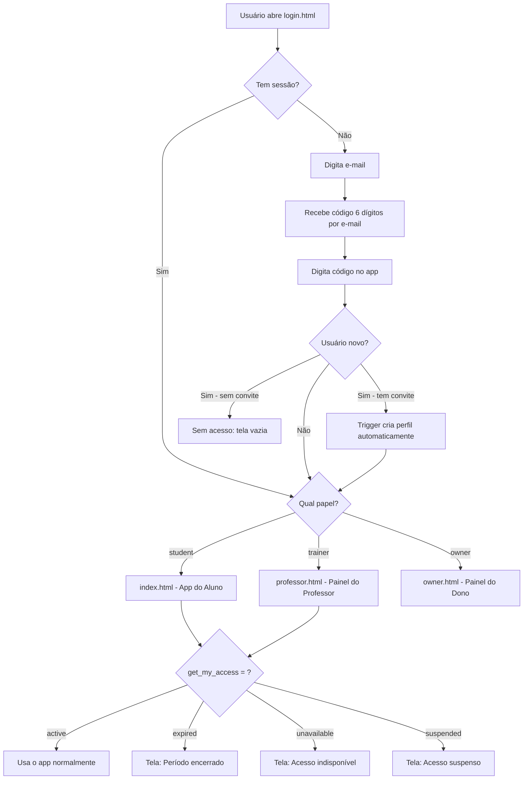
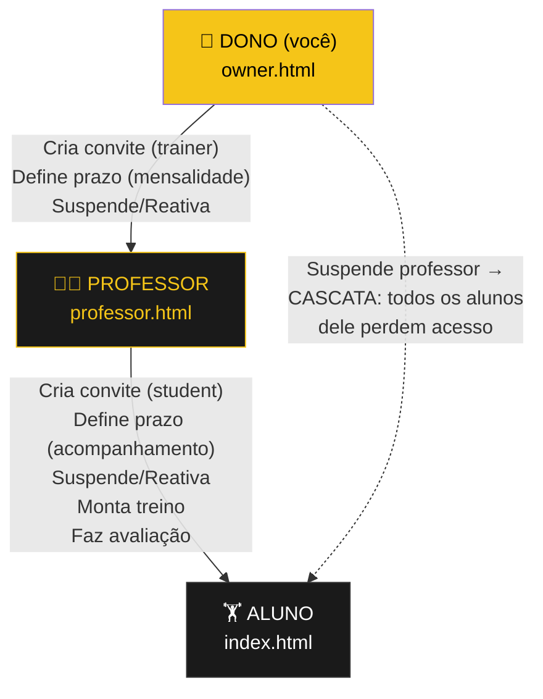
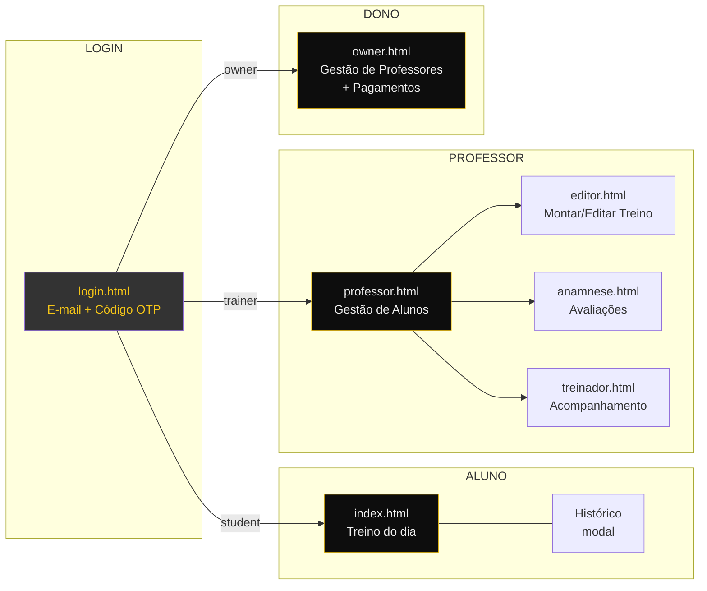
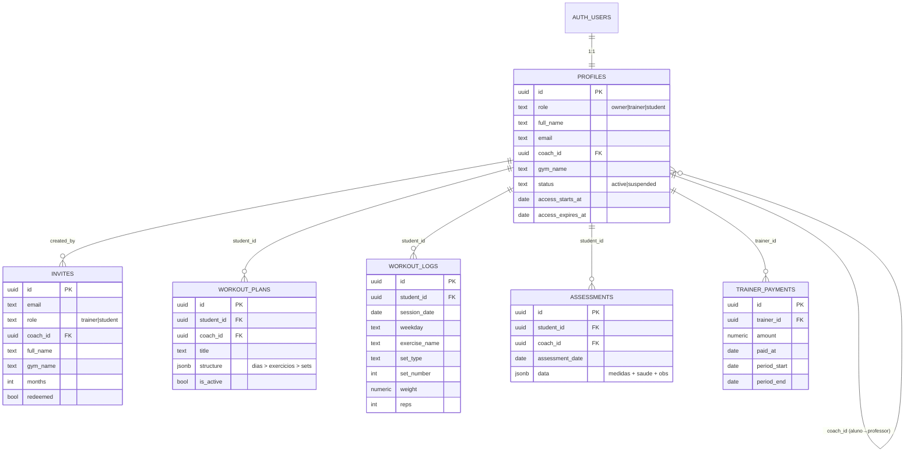
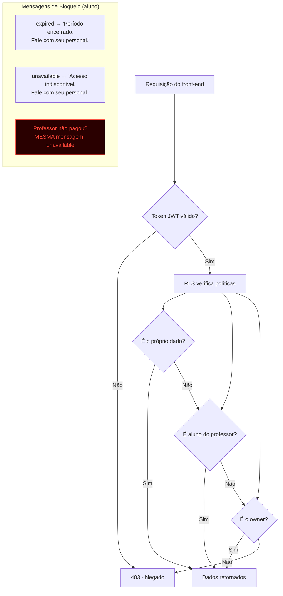
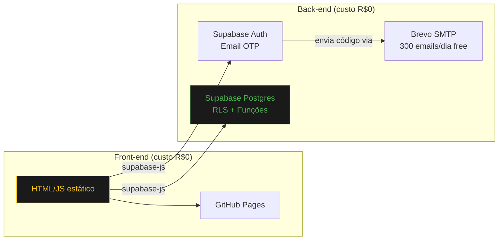

# Fluxograma da Aplicação — App de Treino (Multi-Personal)

> Para visualizar os diagramas abaixo, cole em https://mermaid.live ou abra no VS Code
> com a extensão "Markdown Preview Mermaid Support".

---

## 1. Fluxo de Acesso (Login → Redirecionamento)

---

## 2. Hierarquia de Controle (Quem provisiona quem)

---

## 3. Telas e Navegação

---

## 4. Modelo de Dados (Relacionamento)

---

## 5. Fluxo de Segurança (RLS + Mensagens)

---

## 6. Stack Técnico

